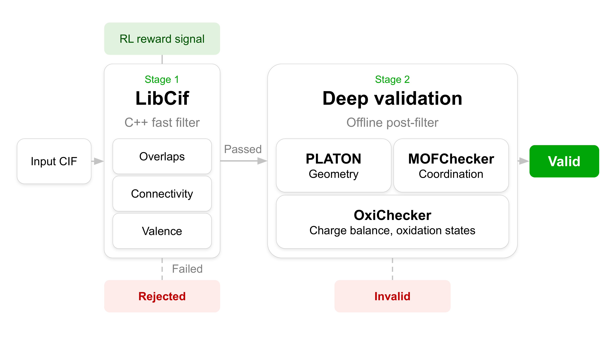

# MOF Sanity Pipeline

Docker-based CIF sanity checker pipeline combining **LibCif**, **PLATON**, **FrameChecker** (MOFChecker based) and **OxiChecker** for validation, decomposition and charge-balance analysis of metal-organic frameworks (MOFs).

The container entrypoint provides a unified CLI that orchestrates all tools from a single command.

> **Reproducing the paper.** The exact code used to produce the validation results reported in the paper is preserved at the [`code-used-in-paper`](https://github.com/insilicomedicine/mof-sanity-pipeline/tree/code-used-in-paper) tag. The `main` branch (this version) continues to evolve; check out the tag if you need bit-for-bit reproducibility of the published results.

## Pipeline Architecture



The pipeline follows a two-stage design:

- **Stage 1 — Fast filter:** LibCif performs a topological pre-check on every input structure. Structures rejected here exit immediately, skipping all heavier analysis.
- **Stage 2 — Full validation:** PLATON (geometry/symmetry), FrameChecker (graph topology), and OxiChecker (decomposition + charge balance) run only on Stage 1 survivors. PLATON is optional but **strongly recommended** — its geometry/symmetry checks have no equivalent in the other stages. Build with `--build-arg WITHOUT_PLATON=1` only when you cannot obtain PLATON sources.

This early-exit design matches the standard pipeline diagram and gives a single fast filter for RL reward signals or large-scale screening.

---

## Requirements

- Docker
- PLATON source files (see below — they must be downloaded separately due to licensing). **Optional:** the image can be built without PLATON via `--build-arg WITHOUT_PLATON=1`; in that case PLATON is fully removed from the pipeline and is not required.

## Installation

### 1. Clone the repository

```bash
git clone https://github.com/insilicomedicine/mof-sanity-pipeline.git
cd mof-sanity-pipeline
```

### 2. Obtaining PLATON sources (optional but strongly recommended)

PLATON is **not distributed** with this repository due to license terms. You can either supply your own PLATON sources to enable PLATON-based geometry/symmetry checks, **or skip PLATON entirely** at build time and let the rest of the pipeline (LibCif + FrameChecker + OxiChecker) run on its own.

> ⚠️ **PLATON is strongly recommended whenever it is available to you.** It is the only stage that performs PLATON-grade geometry/symmetry validation, and dropping it materially weakens the overall sanity verdict. Use `WITHOUT_PLATON=1` only when licensing or distribution constraints make supplying the sources impossible.

#### Option A — Build with PLATON (default)

For licensing and file downloads please visit [official PLATON website](https://www.platonsoft.nl/platon/pl030000.html).

PLATON is free of charge for Academics. For-profit organisations should contact [Ton Spek](mailto:a.l.spek@uu.nl) or forward a filled-out application form before copying the programs.

**After receiving a license** download two files and place them in the `code/` directory:

- `platon.f.gz`
- `xdrvr.c.gz`

#### Option B — Build without PLATON

If you don't want or can't supply PLATON sources, pass `--build-arg WITHOUT_PLATON=1` (any non-empty value) when building. In this mode:

- The PLATON binary is not compiled and not shipped in the image.
- The `--sanity-platon-timeout` flag is hidden from `--help`.
- No `__platon.json` files are produced; the `PLATON Validity` column is omitted from `sanity_results.csv`.
- `Sanity` is computed without the PLATON term.

> **Why this flag is required.** A missing `platon.f.gz` / `xdrvr.c.gz` does **not** silently turn into a PLATON-less build — instead the build fails with an error pointing at the licensing page. `WITHOUT_PLATON=1` exists as an explicit opt-in so that dropping a stage of the validation pipeline has to be a deliberate decision, not a side-effect of forgetting to download the sources. Skipping PLATON measurably weakens the sanity verdict (see the recommendation above), so the build refuses to make that choice on the user's behalf.

### 3. Build the Docker image

```bash
# Default — requires PLATON sources in code/
docker build . -t sanity-pipeline

# Or, without PLATON — no source files needed
docker build --build-arg WITHOUT_PLATON=1 . -t sanity-pipeline
```

The container resolves UID/GID at runtime by inspecting the mounted output directory, so no host UID needs to be baked into the image. Build once, run as any user.

> **Note on hardware optimization and supported platforms.** The PLATON binary is compiled with `-march=native -mtune=native` flags, which target the CPU architecture of the build machine. The pre-built image distributed alongside the paper is therefore optimized for the server it was built on. When you rebuild locally, the resulting image will be optimized for your own hardware — this is the intended behavior, but means the resulting binary is not portable across different CPU architectures. The container has been thoroughly tested on **x86-64 (amd64) Linux** only; full compatibility with other CPU architectures (e.g. arm64) or host operating systems (macOS, Windows) is not guaranteed.

### Running the CLI smoke tests

Smoke tests live in a dedicated build stage (`smoke-test`) and are not baked into the runtime image. Build that target to execute them:

```bash
docker build --target smoke-test -t sanity-pipeline-smoke .
```

The smoke stage runs the full pipeline (sanity → oxichecker → postprocess) over every CIF in `test/test_cifs/` and compares the per-stage JSONs and final CSV columns against the reference fixtures in `test/fixtures/smoke/`. Each step is a separate `RUN`, so BuildKit shows pass/fail per stage in the build progress output. The build succeeds only if every check passes; failures abort the build with the offending diff. The resulting `sanity-pipeline-smoke` image is intended for verification only — keep using the default target (`docker build . -t sanity-pipeline`) for production runs.

Tunable build args:

- `--build-arg SMOKE_NJOBS=N` — parallel workers for the smoke pipeline (default `4`)
- `--build-arg SMOKE_TOTAL_TIMEOUT=SECONDS` — per-structure cap passed as `--sanity-total-timeout` (default `600`)
- `--build-arg WITHOUT_PLATON=1` — also skips PLATON in the smoke stage; the script then loads `test/fixtures/smoke_no_platon/sanity_results.csv` (and the matching stage1 fixture) and skips `__platon.json` comparisons. Use the same value as for the runtime build.

```bash
docker build --target smoke-test --build-arg SMOKE_NJOBS=8 -t sanity-pipeline-smoke .
docker build --target smoke-test --build-arg WITHOUT_PLATON=1 -t sanity-pipeline-smoke-noplaton .
```

Floating-point columns (`density`, `volume`, `reduced_formula`) and `libcif_out`'s formatted-float fields are intentionally excluded from comparisons. Only text/boolean/integer/hash columns are checked, so the tests stay stable across hosts.

---

## Usage

Mount your working directory into `/data` and point the entrypoint at the input and output subpaths inside it. The container resolves UID/GID from the owner of `/data` and drops privileges to that user via `gosu` before any work is done, so the output directory is created from inside the container with your UID/GID — no host-side `mkdir` and no root-owned artefacts:

```bash
docker run --rm \
    -v "$PWD":/data \
    sanity-pipeline \
    -i /data/cifs \
    --output-dir /data/my_results \
    --n-jobs <NUMBER_OF_CPUS>
```

`./my_results/` appears in `$PWD` after the run, owned by you. If `--output-dir` is omitted, results land in `<input>_sanity_results/` next to the input (same ownership rules apply).

If you prefer to keep the input read-only and the output isolated, mount them separately — but in that case **the output directory must exist on the host before `docker run`**, otherwise Docker creates the bind-mount target as root:

```bash
mkdir -p ./my_results
docker run --rm \
    -v "$PWD/cifs":/data_in:ro \
    -v "$PWD/my_results":/data \
    sanity-pipeline \
    -i /data_in \
    --output-dir /data \
    --n-jobs <NUMBER_OF_CPUS>
```

### Run modes

| Flag | Meaning |
|---|---|
| *(no flag)* | Full pipeline: Stage 1 + Stage 2 + postprocessing |
| `--run-sanity-only` | Stage 1 + Stage 2, no postprocessing |
| `--run-stage1-only` | Stage 1 only (LibCif fast filter); useful for RL reward signals |
| `--run-stage2-only` | Stage 2 only (PLATON + FrameChecker + OxiChecker), no LibCif pre-filter |
| `--run-oxichecker-only` | Legacy standalone OxiChecker on a folder of P1 CIFs |
| `--run-postprocess-only` | Final CSV consolidation from existing JSON results |

### Common flags

| Flag | Meaning |
|---|---|
| `-i`, `--input VALUE` | CIF file or directory |
| `--n-jobs VALUE` | Parallel worker count |
| `--output-dir VALUE` | Custom output directory |

### Sanity runner flags (prefix `--sanity-`)

| Flag | Default | Meaning |
|---|---|---|
| `--sanity-total-timeout VALUE` | 300 | Total per-structure timeout (seconds) |
| `--sanity-platon-timeout VALUE` | 120 | PLATON subprocess timeout (hidden in WITHOUT_PLATON builds) |
| `--sanity-libcif-timeout VALUE` | 60 | LibCif subprocess timeout |
| `--sanity-framechecker-timeout VALUE` | 180 | FrameChecker timeout |
| `--sanity-oxichecker-timeout VALUE` | 300 | OxiChecker per-structure timeout |
| `--sanity-decomp-timeout VALUE` | 60 | OxiChecker decomposition (`cif_to_building_blocks_v3`) timeout |
| `--sanity-obabel-timeout VALUE` | 30 | OxiChecker OpenBabel subprocess timeout |
| `--sanity-no-obabel-run` | off | Disable OpenBabel preprocessing |
| `--sanity-recursive` | off | Recursively search for CIFs in input directory |

### Other prefixes

- `--oxichecker-*` — forward to legacy standalone OxiChecker (only applies with `--run-oxichecker-only`)
- `--post-*` — forward to postprocessing (e.g. `--post-output my.csv`)

See `docker run --rm sanity-pipeline --help` for the complete flag list.

---

## Output Structure

```
<output_dir>/
├── babel_cifs/                 # OpenBabel-standardised CIFs (per structure)
├── p1_cifs/                    # P1-symmetry CIFs
├── symm_cifs/                  # Symmetry-processed CIFs
├── results/
│   └── qmof-XXXXXXX/
│       ├── qmof-XXXXXXX.json                # consolidated per-structure result
│       ├── qmof-XXXXXXX.log                 # per-structure log
│       ├── qmof-XXXXXXX__base.json          # preprocessing data
│       ├── qmof-XXXXXXX__libcif.json        # Stage 1
│       ├── qmof-XXXXXXX__platon.json        # Stage 2 (omitted if built WITHOUT_PLATON)
│       ├── qmof-XXXXXXX__framechecker.json
│       ├── qmof-XXXXXXX__oxichecker.json
│       └── decompose/                       # OxiChecker .xyz building blocks
└── sanity_results.csv          # Final consolidated report
```

### `sanity_results.csv` — main columns

**Identification:** `cif`, `content_hash`, `formula`, `reduced_formula`

**Structural properties:** `density`, `volume`, `group_str`, `group_id`, `structure_hash_strict`, `structure_hash`

**Graph analysis:** `is_graph_constructed`, `graph_dim`, `HAS_OMS`, `DECORATED_GRAPH_HASH`, `UNDECORATED_GRAPH_HASH`, `DECORATED_SCAFFOLD_HASH`, `UNDECORATED_SCAFFOLD_HASH`

**Validation results:**
- `Basic Validity` — basic structural validation (boolean)
- `LibCif Validity` — Stage 1 LibCif fast filter (boolean)
- `LibCif_Warning` — LibCif warning messages
- `PLATON Validity` — PLATON geometry check (`True` / `False` / `Check not performed`). **Absent when the image was built with `--build-arg WITHOUT_PLATON=1`.**
- `OxiChecker Validity` — charge balance / oxidation state (string, see below)
- `Sanity` — overall verdict (boolean)

**Chemical sanity checks** (`True` means problem detected):
`has atomic overlaps`, `has overcoordinated c/h/n`, `has lone molecule`, `has bad rare earth`, `has bad alkali alkaline`, `has bad terminal oxo`

### `OxiChecker Validity` values

| Value | Meaning |
|---|---|
| `True` | Successfully decomposed; charges balanced |
| `True; Infinity Node` | Valid; structure contains an infinite node |
| `True; Infinity Linker` | Valid; structure contains an infinite linker |
| `True; no metal` | Structure has no metals (e.g. COF); charge check skipped |
| `Invalid charges` | Charge balance failed |
| `Invalid charges; Infinity Node` | Charge balance failed; infinite node detected |
| `Invalid charges; Infinity Linker` | Charge balance failed; infinite linker detected |
| `Failed to decompose` | LibCif decomposer did not produce output |
| `Empty decomposition` | Decomposer returned no building blocks |
| `No building blocks file` | `num_building_blocks.txt` not found after decomposition |
| `Processing timeout` | Exceeded `--sanity-oxichecker-timeout` |
| `Processing error: ...` | Unhandled exception during processing |
| `Not processed` | OxiChecker stage was not run (e.g. structure rejected at Stage 1, or `--run-stage1-only`) |

### `LibCif Validity` values

| Value | Meaning |
|---|---|
| `True` | Passed Stage 1 LibCif filter |
| `False` | Failed Stage 1; Stage 2 was skipped |

### `PLATON Validity` values

| Value | Meaning |
|---|---|
| `True` | PLATON ran and the CheckCIF report contains no `Unusual sp` alerts |
| `False` | PLATON ran and the CheckCIF report contains at least one `Unusual sp` alert |
| `Check not performed` | PLATON did not run (structure was rejected at Stage 1 by LibCif, or PLATON crashed) |

### Overall `Sanity` verdict

A structure passes overall sanity when **all** conditions hold:

1. All chemical sanity checks are `False` (no problems detected)
2. `Basic Validity`, `LibCif Validity`, and `PLATON Validity` are all `True` — i.e. a `False` *or* a `Check not performed` in any of them fails the verdict (PLATON term is dropped when the image was built `WITHOUT_PLATON`)
3. `OxiChecker Validity` either starts with `True` or equals `Not processed`

### Summary statistics in stdout

At the end of a run, `postprocessing_table_creation.py` prints a summary block to stdout:

```
=== SUMMARY STATISTICS ===
Total structures: <N>
Basic validity: <n>/<N> (%)
LibCif validity: <n>/<N> (%)
PLATON processed: <p>/<N> (%)    # how many structures actually reached PLATON (skipped Stage-1 failures)
PLATON validity: <v>/<p> (%)     # fraction valid AMONG those that PLATON processed
OxiChecker processed: <n>/<N> (%)
OxiChecker valid: <n>/<oxi_processed> (%)
Overall sanity: <n>/<N> (%)
===========================
```

Note the asymmetric denominators: `*-processed` rows divide by total, while `*-valid` rows for PLATON and OxiChecker divide by the processed count (so the percentage reflects the conditional pass rate among structures that actually ran that stage).

---

## Repository Structure

```
mof-sanity-pipeline/
├── code/                       # Core Python pipeline
│   ├── sanity_runner           # main entrypoint, orchestrates Stage 1 + Stage 2
│   ├── utils.py                # run_libcif, run_platon, run_framechecker, run_oxichecker
│   ├── postprocessing_table_creation.py
│   ├── preprocessing.py
│   └── framechecker/
├── oxichecker/                 # OxiChecker module (validate_mof_worker, fragment_analyzer, linker_analyzer)
├── libcif/                     # C++ LibCif library (compiled during build)
├── scripts/                    # CLI smoke tests
├── test/                       # Test CIF files
├── Dockerfile
├── .dockerignore               # excludes VCS, docs, caches and build artefacts from the build context
├── docker-entrypoint.sh        # runtime UID/GID resolver
├── generate_entrypoint.sh      # builds the in-container CLI dispatcher
├── LLM_generated_cifs.zip      # 24,950 LLM-generated CIFs used in the paper (see Citing)
└── README.md
```

---

## LLM-generated CIFs

`LLM_generated_cifs.zip` contains 24,950 candidate MOF structures generated by a large language model. This is the exact dataset evaluated by the sanity pipeline in the paper referenced under [Citing](#citing); it is bundled here so the published results can be reproduced end-to-end. The structures are provided **as generated by the model**, with no geometry optimization or other post-processing applied — this is intentional, as the Sanity Pipeline is benchmarked specifically on raw LLM outputs, where geometric and topological defects are common and rejection rates are the primary quantity of interest. Unzip and pass the resulting `LLM_generated_cifs/` directory as the input to the pipeline:

```bash
unzip LLM_generated_cifs.zip
docker run --rm \
    -v "$PWD":/data \
    sanity-pipeline \
    -i /data/LLM_generated_cifs \
    --output-dir /data/llm_results \
    --n-jobs <NUMBER_OF_CPUS>
```

---

## Citing

If you use this pipeline, please cite the associated ChemRxiv preprint:

> Bezrukov, D., Pupeza, A., Younes, M., et al. *Sanity and Decomposition Pipeline for Metal-Organic Frameworks in Generative AI.* ChemRxiv (2026). DOI: [10.26434/chemrxiv.15003614/v1](https://doi.org/10.26434/chemrxiv.15003614/v1)

<details>
<summary>BibTeX</summary>

```bibtex
@article{Bezrukov2026,
  title = {Sanity and Decomposition Pipeline for Metal-Organic Frameworks in Generative AI},
  url = {http://dx.doi.org/10.26434/chemrxiv.15003614/v1},
  DOI = {10.26434/chemrxiv.15003614/v1},
  publisher = {American Chemical Society (ACS)},
  author = {Bezrukov, Dmitry and Pupeza, Aleksandr and Younes, Mourad and Rublev, Pavel and Romashin, Ivan and Kamorzin, Boris and Alhammad, Bashaer and Aljama, Hassan and Toro, Frankly and Alahmed, Ammar and Iamashev, Mikhail and Mazaleva, Olga and Permyakova, Anastasia and Aliper, Alex and Zhavoronkov, Alex and Badra, Jihad},
  year = {2026},
  month = May
}
```

</details>

## License

The code in this repository is released under the MIT License.

Parts of this code are derived from MOFChecker, which is also distributed
under the MIT License. The original MOFChecker copyright and license
notice are preserved in THIRD_PARTY_NOTICES.md.

PLATON is not included in this repository and is not redistributed under
this repository's MIT License. PLATON support is implemented only as an
integration layer that invokes the external PLATON binary. Users must
obtain PLATON separately and comply with the PLATON license terms.
